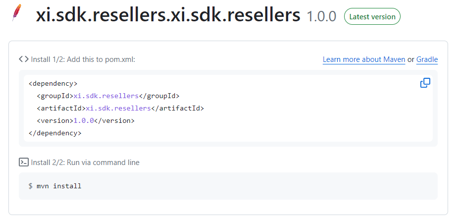

---

### [Corp](https://www.ingrammicro.com/)  |  [Developer Portal](https://developer.ingrammicro.com/)  |  [Getting Started](https://www.ingrammicro.com/en-us/partner/become-a-reseller)  |  [Become a Reseller](https://www.ingrammicro.com/en-us/partner/become-a-reseller)  |  [About](https://www.ingrammicro.com/en-us/company/about-us) ###

# Ingram Micro

[Ingram Micro](https://www.ingrammicro.com/) is the business behind the world's brand's - maximizing the value of the technology they make, sell or use.

We amplify thousands for vendors, resellers and retails partners by customizing and delivering highly targeted solutions and services for industary verticals, business-to-business, customers and commercial needs.

Our vast global infrastructure enables business partners to operate more efficiently and successfully. No other company delivers such a broad and deep spectrum of technology services to the businesses around the world.

# Xvantage

Ingram Micro's digital experience platform Xvantage, connects thousands of technologies and vendors with our associates spanning six continents to learn, transact and partner to run thier business bette and grow faster.

# Xvantage Integration (XI)

Xvantage Integration **XI** exposes various Application Programming Interfaces (API's) for resellers to connect and consume Xvantage data into their custom built applications and workflows. For more infromation refer [Developer Portal](https://developer.ingrammicro.com/ "Developer Portal").

# XI SDKs

XI Sdks enables XI consumers to convinently use the XI API's in their custom built application and greately reduces the development time.

Following **Server Side SDK's** are currently published for XI Resellers use

| Language                                                  | Github Repo Path                                                                                                    | Package Manager                                        | SDK Installation                                                                                                                                                                                                     |
| --------------------------------------------------------- | ------------------------------------------------------------------------------------------------------------------- | ------------------------------------------------------ | -------------------------------------------------------------------------------------------------------------------------------------------------------------------------------------------------------------------- |
|               | [C# SDK Repo](https://github.com/ingrammicro-xvantage/xi-sdk-csharp)                                                   |  | [https://www.nuget.org/packages/xi.sdk.resellers](https://www.nuget.org/packages/xi.sdk.resellers)   `Install-Package xi.sdk.resellers`                                                                     |
|        | [Java](https://github.com/ingrammicro-xvantage/xi-sdk-java)[SDK Repo](https://github.com/ingrammicro-xvantage/xi-sdk-java) |  | [https://github.com/ingrammicro-xvantage/xi-sdk-resellers-java](https://github.com/ingrammicro-xvantage/xi-sdk-resellers-java)      |
|    | [Node SDK Repo](https://github.com/ingrammicro-xvantage/xi-sdk-node)                                                   |        | [https://www.npmjs.com/package/xi_sdk_resellers](https://www.npmjs.com/package/xi_sdk_resellers)   `npm i xi_sdk_resellers`                                                                                 |
|  | [Python SDK Repo](https://github.com/ingrammicro-xvantage/xi-sdk-python)                                               |     | [https://pypi.org/project/xi.sdk.resellers](https://pypi.org/project/xi.sdk.resellers)   `pip install xi.sdk.resellers`                                                                                |
|              | [GO SDK Repo](https://github.com/ingrammicro-xvantage/xi-sdk-go)                                                       |    | [https://github.com/ingrammicro-xvantage/xi-sdk-resellers-go](https://github.com/ingrammicro-xvantage/xi-sdk-resellers-go)  `import xi_sdk_resellers "github.com/ingrammicro-xvantage/xi-sdk-resellers-go"` |

# XI Reseller API List

**Sandbox**: [https://api.ingrammicro.com:443/sandbox/
](https://api.ingrammicro.com/resellers/v6)**Production**: [https://api.ingrammicro.com:443/](*https://api.ingrammicro.com:443*/)

| **API Group** | **API**                | **API Url**                                                                                                                                                              |
| ------------------- | ---------------------------- | ------------------------------------------------------------------------------------------------------------------------------------------------------------------------------ |
| Authentication      | Get AccessToken              | `GET` [https://api.ingrammicro.com:443/oauth/oauth20/token](https://api.ingrammicro.com:443/oauth/oauth20/token)       |
| Product Catalog     | Price And Availability (PNA) | `POST` [https://api.ingrammicro.com:443/resellers/v6/catalog/priceandavailability](https://api.ingrammicro.com:443/sandbox/resellers/v6/catalog/priceandavailability)          |
|                     | Search Products              | `GET` [https://api.ingrammicro.com:443/resellers/v6/catalog](https://api.ingrammicro.com:443/sandbox/resellers/v6/catalog)                                                     |
|                     | Product Details              | `GET`[https://api.ingrammicro.com:443/resellers/v6/catalog/details/{ingramPartNumber}](https://api.ingrammicro.com:443/sandbox/resellers/v6/catalog/details/{ingramPartNumber}) |
| Orders              | Create Your Order            | `POST` [https://api.ingrammicro.com:443/resellers/v6/orders](https://api.ingrammicro.com:443/sandbox/resellers/v6/orders)                                                      |
|                     | Modify Your Order            | `PUT` [https://api.ingrammicro.com:443/resellers/v6/orders/{orderNumber}](https://api.ingrammicro.com:443/sandbox/resellers/v6/orders/{orderNumber})                           |
|                     | Get Order Details 6.1        | `GET` [https://api.ingrammicro.com:443/resellers/v6.1/orders/{ordernumber}](https://api.ingrammicro.com:443/sandbox/resellers/v6.1/orders/{ordernumber})                       |
|                     | Search Orders                | `GET` [https://api.ingrammicro.com:443/resellers/v6/orders/search](https://api.ingrammicro.com:443/sandbox/resellers/v6/orders/search)                                         |
|                     | Cancel Orders                | `Delete` [https://api.ingrammicro.com:443/resellers/v6/orders/{OrderNumber}](https://api.ingrammicro.com:443/sandbox/resellers/v6/orders/{OrderNumber})                        |
| Quotes              | Quotes Search                | `GET` [https://api.ingrammicro.com:443/resellers/v6/quotes/search](https://api.ingrammicro.com:443/sandbox/resellers/v6/quotes/search)                                         |
|                     | Quote Details                | `GET` [https://api.ingrammicro.com:443/resellers/v6/quotes/{quoteNumber}](https://api.ingrammicro.com:443/sandbox/resellers/v6/quotes/{quoteNumber})                           |
|                     | Validate Quote               | `GET` [https://api.ingrammicro.com:443/resellers/v6/q2o/validatequote](https://api.ingrammicro.com:443/sandbox/resellers/v6/q2o/validatequote)                                 |
| Quote To Order      | Quote To Order               | `POST` [https://api.ingrammicro.com:443/resellers/v6/q2o/orders](https://api.ingrammicro.com:443/sandbox/resellers/v6/q2o/orders)                                              |
| Invoice             | Search Invoice               | `GET` [https://api.ingrammicro.com:443/resellers/v6/invoices/](https://api.ingrammicro.com:443/sandbox/resellers/v6/invoices/)                                                 |
|                     | Get Invoice Details 6.1      | `GET` [https://api.ingrammicro.com:443/resellers/v6.1/invoices/{invoiceNumber}](https://api.ingrammicro.com:443/sandbox/resellers/v6.1/invoices/{invoiceNumber})               |
| Renewals            | Renewals Search              | `POST` [https://api.ingrammicro.com:443/resellers/v6/renewals/search](https://api.ingrammicro.com:443/sandbox/resellers/v6/renewals/search)                                    |
|                     | Renewals Details             | `GET` [https://api.ingrammicro.com:443/resellers/v6/renewals/{renewalId}](https://api.ingrammicro.com:443/sandbox/resellers/v6/renewals/{renewalId})                           |
| Deals               | Deals Search                 | `GET` [https://api.ingrammicro.com:443/resellers/v6/deals/search](https://api.ingrammicro.com:443/sandbox/resellers/v6/deals/search)                                           |
|                     | Deals Details                | `GET` [https://api.ingrammicro.com:443/resellers/v6/deals/{dealId}](https://api.ingrammicro.com:443/sandbox/resellers/v6/deals/{dealId})                                       |
| Returns             | Returns Search               | `GET` [https://api.ingrammicro.com:443/resellers/v6/returns/search](https://api.ingrammicro.com:443/sandbox/resellers/v6/returns/search)                                       |
|                     | Returns Details              | `GET` [https://api.ingrammicro.com:443/resellers/v6/returns/{caseRequestNumber}](https://api.ingrammicro.com:443/sandbox/resellers/v6/returns/{caseRequestNumber})             |
|                     | Returns Create               | `POST` [https://api.ingrammicro.com:443/resellers/v6/returns/create](https://api.ingrammicro.com:443/sandbox/resellers/v6/returns/create)                                      |
| Freight Estimate    | Freight Estimate             | `POST` [https://api.ingrammicro.com:443/resellers/v6/freightestimate](https://api.ingrammicro.com:443/sandbox/resellers/v6/freightestimate)                                    |
| Order StatusWebhook | Order Status                 | `POST` [https://api.ingrammicro.com:443/resellers/v1/webhooks/orderstatusevent](https://api.ingrammicro.com:443/sandbox/resellers/v1/webhooks/orderstatusevent)                |
| Stock UpdateWebhook | Stock Update                 | `POST` [https://api.ingrammicro.com:443/resellers/v1/webhooks/availabilityupdate](https://api.ingrammicro.com:443/sandbox/resellers/v1/webhooks/availabilityupdate)            |

# Important Links

* [Developer Portal](https://developer.ingrammicro.com)
* [Getting Started](https://developer.ingrammicro.com/reseller/getting-started/api-overview)
* [API Documentation](https://developer.ingrammicro.com/reseller/api-documentation)
* [FAQ](https://developer.ingrammicro.com/reseller/faq)
* [Open API Spec](https://github.com/ingrammicro-xvantage/xi-sdk-openapispec)
* [Support &amp; Discussions](https://github.com/orgs/ingrammicro-xvantage/discussions)
